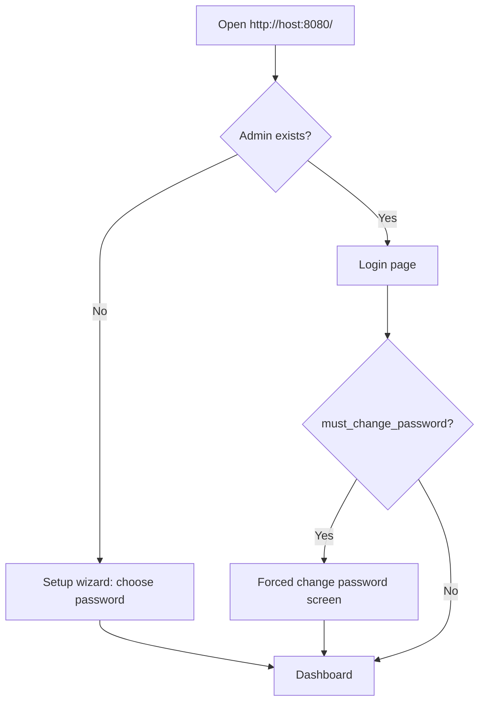

# AI-07 — Phase 3.5 Plan (Web Login, Admin Reset & Help)

> Status: **complete** (v0.0.4)  
> Product: **msgate**  
> Insert **before Phase 4** (Graph backend)

---

## Decision: Yes — required before exposing UI beyond localhost

| Risk today (Phase 3) | Mitigation (Phase 3.5) |
| --- | --- |
| Anyone on the network can open `/` and read queue/config | Login required |
| `/api/v1/config` exposes EWS settings | Session-protected API |
| No recovery if password forgotten | Root-only CLI reset |

**Default bind stays `127.0.0.1`.** Phase 3.5 is for operators who bind UI to LAN/VPN or reverse-proxy.

---

## Chosen approach: first-run web setup (no default password)

Evaluated options:

| Option | Verdict |
| --- | --- |
| Fixed default (`admin` / `changeme`) + red bar | ❌ Too easy to forget; unsafe on LAN |
| Random password only in terminal logs | ❌ Lost scrollback; bad for Docker |
| Force reset on every first login | ✅ Good for bootstrap cases |
| **First-run setup wizard in browser** | ✅ **Primary path — most user-friendly** |

### How it works



1. **Fresh install (normal path)**  
   - No admin row in SQLite.  
   - Browser shows **“Create administrator password”** (username fixed: `admin`).  
   - User picks password → goes straight to dashboard.  
   - **No** hardcoded default. **No** password in logs.

2. **Terminal hint (discoverability)**  
   On first `msgate serve` when no admin exists:

   ```
   ═══════════════════════════════════════════════════════
   msgate: No admin account yet.
   Open http://127.0.0.1:8080/ in your browser to set your password.
   ═══════════════════════════════════════════════════════
   ```

3. **Docker / automation (optional)**  
   Set `MSGATE_ADMIN_PASSWORD` to pre-create admin.  
   - First login with that password → **forced “Choose a new password”** (cannot skip).  
   - **Red warning bar** at top until the new password is saved:  
     *“Temporary password in use — change it now.”*

4. **Root CLI reset**  
   `sudo msgate admin reset-password` sets a new password and `must_change_password=true`.  
   Next web login → same forced change + red bar until the user picks their own password.

### Why this wins

- Operators are already opening the UI — setup happens where they work.  
- No hunting through install logs or copying random strings.  
- No insecure default left running with only a banner.  
- Automation still works via env var, with a mandatory upgrade to a real password.

---

## Scope

### In scope

1. **Single admin account** (username `admin`)
2. **First-run setup wizard** at `/ui/setup` (only when no admin exists)
3. **Login page** at `/ui/login`
4. **Forced password change** at `/ui/change-password` when `must_change_password=true`
5. **Red warning bar** in UI layout while `must_change_password=true`
6. **Session cookie** after successful login (HttpOnly, SameSite=Lax)
7. **Protect:** all HTML UI + `/api/v1/*` except `/healthz`, `/readyz` and `/ui/setup` (when unconfigured)
8. **CLI reset:** `sudo msgate admin reset-password` (uid 0 only)
9. **Help:** sidebar link to GitHub Pages

### Out of scope (later)

- Multi-user / RBAC
- OIDC / LDAP / SSO
- “Forgot password” email flow
- Full help wiki inside the app

---

## Admin password reset (terminal)

```bash
# Must run as root
sudo msgate admin reset-password

# Prompts for new password (twice), writes bcrypt hash to SQLite
# Sets must_change_password=true
# Prints: "Admin password updated. User must set a new password on next login."
```

**Why root-only:** msgate data dir (`data/`) is owned by the service user; root can always recover. Avoids unauthenticated reset attacks.

---

## Environment variables

| Variable | Purpose |
| --- | --- |
| `MSGATE_ADMIN_PASSWORD` | Optional bootstrap password (Docker/CI). Triggers forced change on first login. |
| `MSGATE_HELP_URL` | GitHub Pages docs URL for Help link |
| `MSGATE_SECRET_KEY` | Session signing (existing) |

---

## Help page strategy

**Link to GitHub Pages — do not maintain two doc sets.**

| Item | Value |
| --- | --- |
| Env var | `MSGATE_HELP_URL` |
| Default | `https://<your-org>.github.io/msgate/` (set at release) |
| UI | Sidebar **Help ↗** opens new tab |
| Optional | `/ui/help` page with short blurb + button “Open full documentation” |

---

## Task checklist (mirrors AI-01)

| ID | Task |
| --- | --- |
| P3.5-1 | Alembic migration: `admin_users` (`password_hash`, `must_change_password`, `created_at`) |
| P3.5-2 | bcrypt hash via `passlib` or `bcrypt` |
| P3.5-3 | FastAPI session middleware + setup/login/logout/change-password routes |
| P3.5-4 | `msgate admin reset-password` subcommand (root check) |
| P3.5-5 | First-run setup wizard + terminal banner on `msgate serve` |
| P3.5-6 | `MSGATE_HELP_URL` + sidebar Help link |
| P3.5-7 | `/ui/help` redirect or minimal landing |
| P3.5-8 | pytest: setup wizard, login, forced change, CLI reset |
| P3.5-9 | Red warning bar component when `must_change_password=true` |

---

## Checkpoint 3.5

- [ ] Fresh install → browser shows setup wizard (not login)
- [ ] After setup → dashboard works without red bar
- [ ] `MSGATE_ADMIN_PASSWORD` → login → forced change → red bar gone
- [ ] Wrong password → 401, no session
- [ ] `curl /api/v1/config` without cookie → 401
- [ ] `curl /healthz` without cookie → 200
- [ ] `sudo msgate admin reset-password` works; non-root fails
- [ ] Help link opens GitHub Pages URL
- [ ] Terminal banner shown when no admin on `msgate serve`

---

## GitHub Pages — user manual snippet (future)

> **First time:** Open the msgate URL in your browser. You will be asked to **create an administrator password** (username: `admin`).
>
> **Lost password:** Ask your server admin to run `sudo msgate admin reset-password`.
>
> **Help:** Click **Help** in the sidebar for the full documentation.

---

## Next step after 3.5

Proceed to **Phase 4 — Microsoft Graph backend**.
